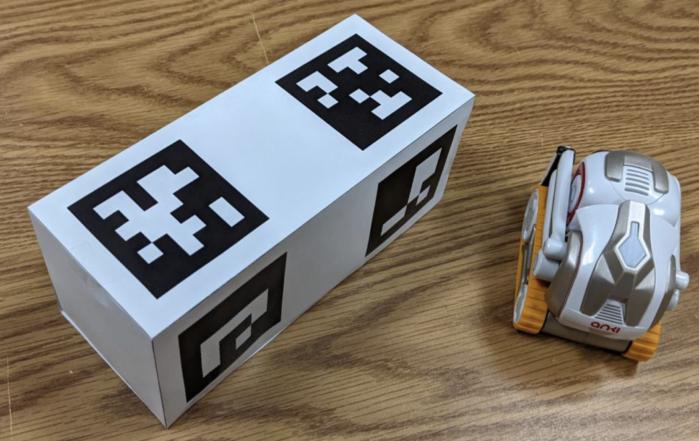
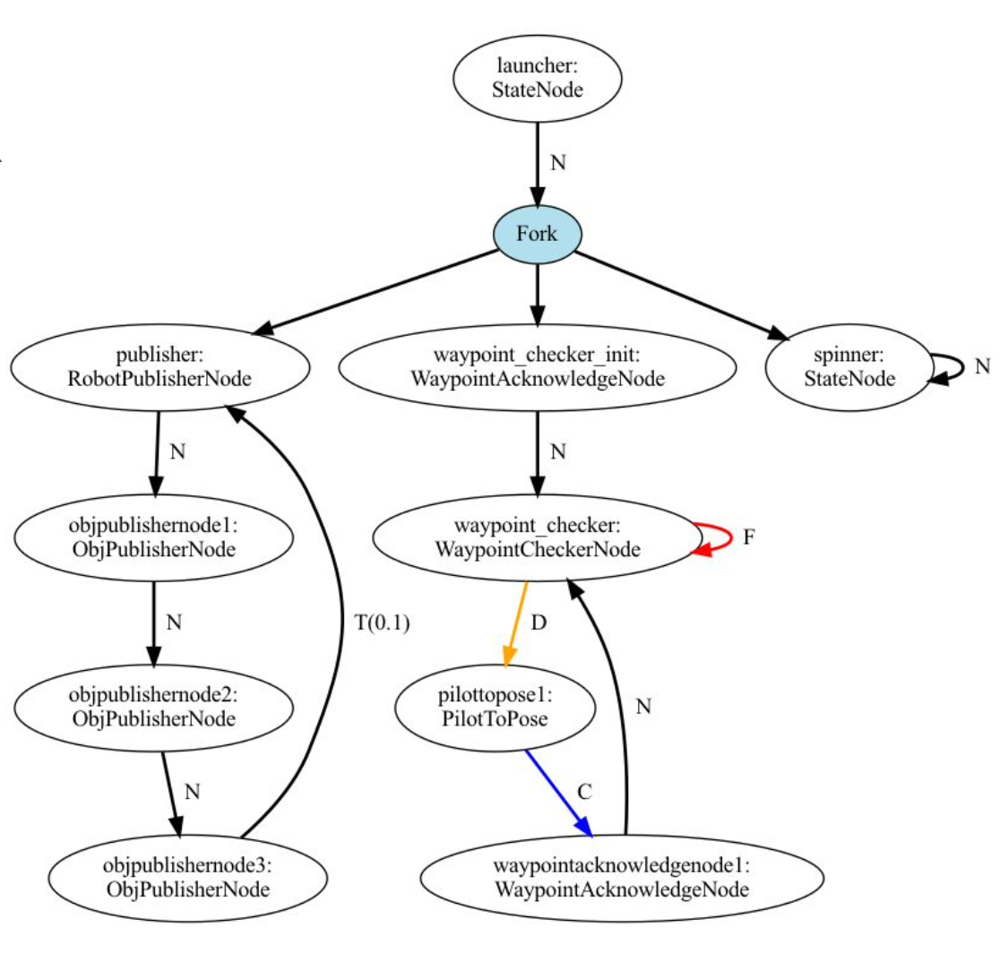

# Mixed-Reality Cozmo Robot Digital Twin

The goal of this project is to use augmented reality to visualize the world map and navigation-stack of a small ground-based robot. 

- The primary goal of this project is to be an educational tool to more intuitively understand the robot's localization capabilities and how it differs from the robot's actual location.
- Additionally, this project works towards developing a platform for third-person remote-control of robots while exploring a foreign environment.


## Dependencies

This system runs on top of [CONIX ARENA](http://arena.conix.io) for the AR graphics rendering. ARENA is cross-platform and can be run on iOS, Android, web browsers, and any headset supporting WebXR (including HoloLens, Oculus, and Magic Leap).

The robot platform used is the [Cozmo](https://www.digitaldreamlabs.com/pages/cozmo). The framework used to communicate with the robot is [cozmo-tools by Dave Touretzky](https://github.com/touretzkyds/cozmo-tools).

To install the Python (3.7 or newer) dependencies:
```
pip3 install -r requirements.txt
```

This will install ARENA-py, Flask (which is used to bridge the Cozmo process with the ARENA process), and the other required libraries. To install `cozmo_fsm` and its dependencies, see the instructions in the [cozmo-tools repository](https://github.com/touretzkyds/cozmo-tools)

## Running the demo

To run the demo, first run `python3 arena_app.py`. The first time you run this, it will request authentication with ARENA using a Google account (either in the terminal or by popping up a browser); you must complete this authentication in order to use ARENA. Once it has completed, you should see a log entry that looks like the following, which will give you the link that you can launch in a web browser to see the scene in ARENA.

```
Loading: https://arenaxr.org/YOURARENAUSERNAME/cozmo-new, realm=realm
Connecting to the ARENA...
```

The augmented reality demo runs best on a modern iPhone or iPad (inside of [XR Browser](https://apps.apple.com/ng/app/xr-browser/id1588029989)) but can also be run on a sufficiently-powerful Android device using Chrome Beta.

Next, print and cut out a "universal marker." The default configuration uses only one marker, `tags/tags_1_4.pdf`. This should be printed, cut out, folded up, and glued together. The top side is an AprilTag (for the ARENA app to detect) while the front and back sides have ArUco markers (for Cozmo to detect). It allows the AR app to localize itself relative to Cozmo to make it easier to visualize exactly where the robot thinks it is.



Finally, to run the program on Cozmo, launch a new shell (while `arena_app.py` is running in its own process). Start with `genfsm cozmo_ar.fsm` to generate the python FSM file. Launch `simple_cli` (from cozmo-tools) and run `show all` (to see the camera feed and particle viewer) and then `runfsm("cozmo_ar")` to start the example FSM.



If you are viewing the ARENA scene in a browser or mobile device (and the origin AprilTag on the `1_4` universal marker has been detected), then you should now see a 3D model of Cozmo at its estimated location, as well as a small colored circle which follows your "gaze". Tapping the screen places a waypoint at this colored circle and commands the robot to drive there.

## Demo Video

This demo video shows the three modalities of the system. The first segment shows the top-down AR mode, in which the AR system visualizes exactly where the robot thinks it is (the drift/error shows the imprecisions in the particle filter). The mobile device is able to place "waypoints" for Cozmo to drive to. The second segment shows the "immersive" mode, which is used for remote control of the robot from afar. In this mode, the entire world is scaled up, and the user places waypoints using the hand-tracking module on the HoloLens. The third segment is the immersive mode but shown in a browser, from a 3rd-person perspective (the system is designed such that multiple users can view it in AR at once).

[https://youtu.be/AXnh5hB7WAg](https://youtu.be/AXnh5hB7WAg)
